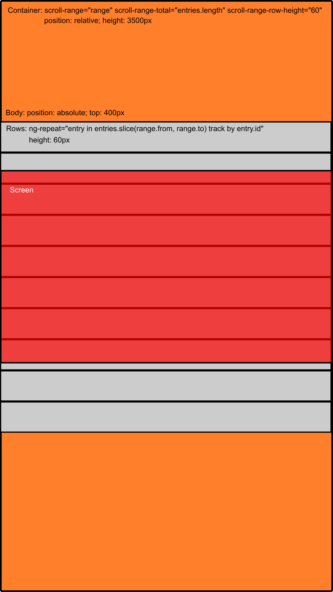

# angular-scroll-range

Unlimited scrolling for AngularJS

## Example

[Basic example](https://bancek.github.io/angular-scroll-range/examples/basic.html)

## How it works

Only the rows that are visible on the screen (and few more for smoother scrolling) are rendered within the body. Body is then positioned into the container.

When the user scrolls the body's `top` changes and `range` object in the scope is updated with new `from` and `to` values. `ng-repeat` then slices the original array to render only required rows.

